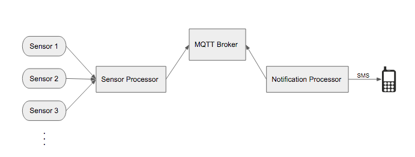

[](https://drone.io/github.com/wfernandes/iot/latest)

## IoT Sensor Notification System

This is a first pass at creating a working end-to-end system that consumes sensor data/events and notifies a user.


The intention of this project was to create a platform where a user could be notified upon certain conditions of
sensor input data. 

The sensor processor which would run on something like a Raspberry Pi or Intel Edison would consume sensor data/events
 and send it to the notification processor over UDP. The notification processor could either run on a local machine or 
 on the cloud, say on a platform like [Cloud Foundry](http://docs.cloudfoundry.org/concepts/).
 
### Architecture



### Tests
```
ginkgo -r
```

### Wiki

The [wiki](https://github.com/wfernandes/IoT/wiki) contains more information regarding process, troubleshooting and setup I did so that I could reference my silliness in the future.

### Future Work

I've been tracking ideas on the [issues page](https://github.com/wfernandes/IoT/issues) and marking what is important to work on.